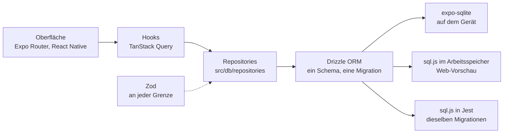
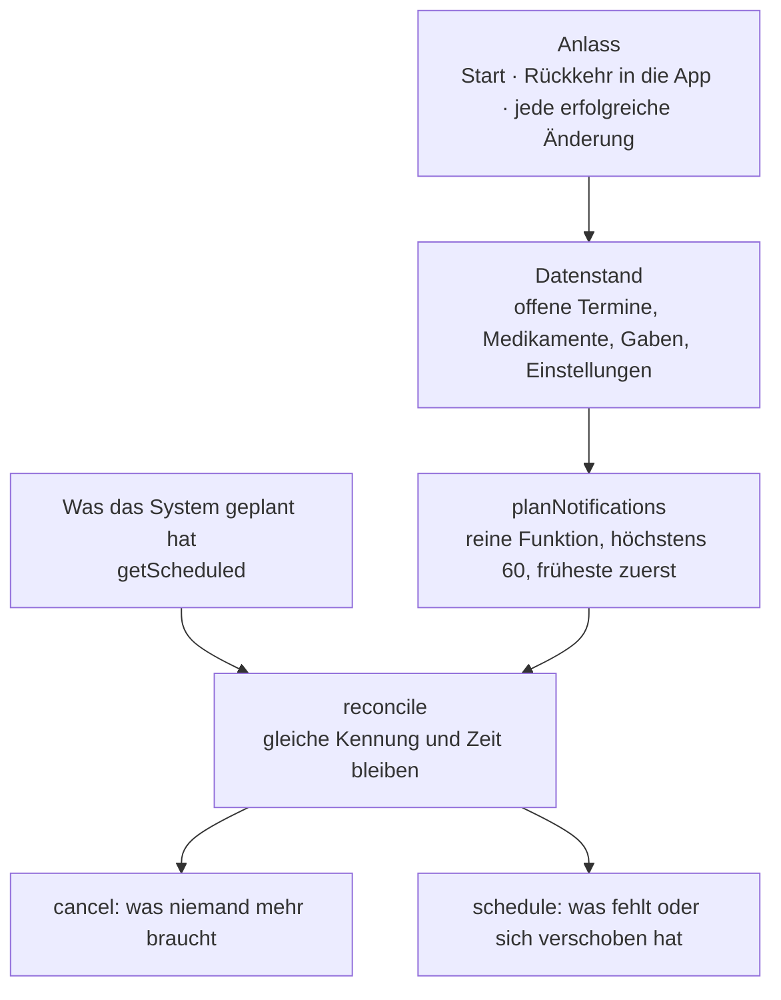
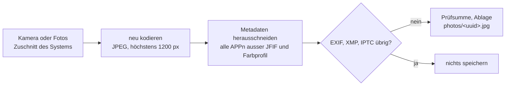

# Architektur

Hundebüechli ist eine Expo-App (SDK 57, React Native 0.86) ohne Server. Alles, was die App weiss,
liegt in einer SQLite-Datenbank auf dem Gerät; die Oberfläche liest und schreibt über Hooks, die
Hooks über Repositories. Dieselben Repositories laufen auf dem Gerät, in der Web-Vorschau und in
den Tests – nur die Datenbank darunter wechselt.

## Datenfluss

- **Repositories nehmen die Datenbank als Parameter** (`Db`). Deshalb laufen die Tests gegen eine
  echte SQLite-Datenbank (sql.js) mit denselben Migrationen wie auf dem Gerät, ohne Attrappe.
- **TanStack Query** hält die gelesenen Daten und lädt gezielt neu (`src/db/query-keys.ts`).
  «Als Nächstes» lädt erst wieder, wenn der Bildschirm neu geöffnet wird – nichts springt unter dem
  Finger weg.
- **Zod** prüft jede Eingabe, bevor sie in die Datenbank geht (`src/domain`); die Formulare
  übersetzen die Fehlerkürzel in Sätze (`src/content/validation.ts`).
- **Kein Netzwerkcode:** Eine ESLint-Regel sperrt `fetch`, `XMLHttpRequest`, WebSockets und
  Download-Funktionen in `app/` und `src/`; ein Browsertest prüft, dass die Vorschau keine
  Anfrage an Dritte stellt.

## Benachrichtigungen als Ableitung des Datenstands

Eine Erinnerung, die nicht kommt, ist schlimmer als keine. Darum gibt es keinen Code, der «bei
dieser Änderung eine Benachrichtigung planen» sagt. Stattdessen rechnet eine reine Funktion aus dem
ganzen Datenstand, was geplant sein soll, und eine zweite vergleicht das mit dem, was das System
wirklich geplant hat.

- **Kennungen sind deterministisch:** `due:<eintrag>:<datum>` und `dose:<medikament>:<zeitpunkt>`.
  Daran erkennt der Abgleich, was schon steht; zweimal ausgeführt ändert er nichts.
- **Nur Einmal-Auslöser mit Datum.** Die wiederholenden Auslöser von `expo-notifications` sind je
  Plattform verschieden; die App rechnet Wiederholungen selbst.
- **iOS behält nur die 64 nächsten** geplanten Benachrichtigungen. Die App plant höchstens 60; der
  Rest folgt beim nächsten Abgleich.
- **Das Gerät steckt hinter einer schmalen Schnittstelle** (`NotificationPort`): auf dem Gerät
  `expo-notifications`, im Browser eine Fassung ohne Wirkung, in den Tests eine Attrappe.
- **Wann abgeglichen wird:** `NotificationHub` hört den Mutation-Cache von TanStack Query ab –
  jede erfolgreiche Änderung löst den Abgleich aus, ohne dass ein Formular daran denken muss.
- **Antworten:** Tippen öffnet den Eintrag (bei Medikamenten «Als Nächstes»); die Aktionen
  «Erledigt» und «Gegeben» wirken direkt über die Repositories.

Tests: `src/domain/__tests__/notifications.test.ts` (Vorlauf, Monatsende, Schalttag,
Zeitumstellung, Grenze 60, Reihenfolge, Idempotenz, beendete und ruhende Medikamente) und
`src/notifications/__tests__/sync.test.ts` (Abgleich gegen die Attrappe, archivierte Hunde, Gaben,
geänderte Uhrzeit, fehlende Erlaubnis).

## Fotos

Gelöscht wird nur, was nach einem selbst angelegten Pfad aussieht; ein veränderter Eintrag in der
Datenbank kann so keine fremde Datei treffen.

## PDFs

`src/pdf/collect.ts` liest die Daten und formatiert sie fertig; `src/pdf/templates.ts` setzt nur
zusammen und maskiert jede Zeichenkette. Auf dem Gerät macht `expo-print` daraus ein A4-PDF mit
eingebetteter Schrift, `expo-sharing` öffnet das Teilen-Blatt. Im Browser öffnet sich dieselbe
Vorlage in einem eigenen Fenster mit dem Druckdialog.

## Ordner

| Ordner | Inhalt |
|---|---|
| `app/` | Routen von Expo Router, dünn: Parameter lesen, Bildschirm zeigen |
| `src/features/` | Bildschirme und ihre Hooks, je Bereich ein Ordner |
| `src/domain/` | reine Logik und Schemas: Fälligkeiten, Plan der Benachrichtigungen, Gewicht, Metadaten |
| `src/db/` | Schema, Migrationen, Repositories, Anbindung an expo-sqlite und sql.js |
| `src/notifications/` | Abgleich und Anbindung ans Gerät |
| `src/pdf/` | Datensammlung, Vorlagen, Erzeugen und Teilen |
| `src/photos/`, `src/files/` | Import und Ablage der Fotos |
| `src/ui/` | Bausteine nach dem Entwurf, Tokens, Tab-Leiste |
| `src/content/` | alle Texte der Oberfläche an einem Ort |
| `src/demo/` | Beispieldaten Bäri und Mila |
| `e2e/` | Playwright gegen den Web-Export |
| `scripts/` | Prüfungen, Web-Härtung, Bildschirmfotos, Berechtigungen der APK |
